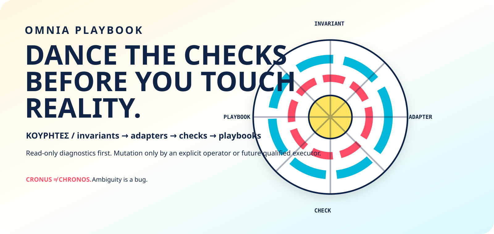

<p align="center">
  
</p>

<h1 align="center">OMNIA PLAYBOOK</h1>
<p align="center"><strong>GIVE SURPRISE A BASELINE AND A NAME.</strong></p>
<p align="center"><em>If the machine has an alibi, ask for the observation.</em></p>

<p align="center">
  <a href="https://blueshoes.space/rhea/">The Rhea family</a> ·
  <a href="foundation/">Invariants</a> ·
  <a href="checks/">Checks</a> ·
  <a href="playbooks/">Playbooks</a>
</p>

Yesterday the network worked. Today a familiar name leads somewhere unexpected. Someone says “just change the DNS.” Someone else blames the router. The most confident explanation arrives first. The evidence has yet to leave the machine.

**Omnia Playbook is an operational knowledge corpus for making infrastructure explain itself:** what must remain true, how a platform expresses it, what a check actually observed, and which procedure could address the result.

**On `main` today:** invariant/check/environment schemas, fixtures, foundation documents, platform adapter scaffolds, a read-only DNS diagnostic and report scripts. The executable checks are narrower than the platform directory list. This is an early corpus, with a known validation failure detailed below.

## Start with the resolver you actually have

A DNS resolver helps turn a name into an address. If its configuration changes unexpectedly, a useful first question is simple: **which resolver is this machine configured to ask?**

The [DNS invariant](foundation/dns.md) gives that question a home. The [diagnostic script](scripts/diagnose.sh) has inspection paths for macOS, Linux/OpenWrt and Windows. An observation can record what those commands return. It cannot, by itself, prove that the resolver is trustworthy or identify the cause of every connection failure.

That modest distinction is powerful. It gives an operator something to challenge, compare and reproduce before a proposed “fix” rewrites the evidence.

## Knowledge has routes, too

**Topology is the connection structure.** On a network, it asks which machines can reach which others. In an operational corpus, it asks which claim leads to which invariant, platform mapping, observation and procedure. A command copied into a chat has almost none of those connections. A check with provenance can lead you back to its assumptions.

**Geometry gives those connections a measure.** How many unsupported assumptions sit between a symptom and a diagnosis? How old is the observation? How costly would a mistaken repair be? Those are useful questions for comparing investigative paths; they are not scores the current scripts compute.

**Flow is what travels through the structure:** observations become reports, reports inform proposals, and an authorized operator may choose a procedure. The place where information becomes permission matters more than the number of dashboards upstream.

```text
invariant ──► platform mapping ──► read-only check ──► observation
                                                         │
                                                         ▼
                                                      report
                                                         │
                                              human assessment
                                                         │
                                                         ▼
                                               proposed procedure
                                                         │
                                        separate execution authority
```

*A map of responsibilities. The repository does not implement an automatic execution pipeline.*

Control the default explanation and you can steer every repair. **Make the route from claim to evidence visible, and that power becomes contestable.**

## Each layer has a job

| Location | Responsibility |
|---|---|
| [foundation/](foundation/) | State platform-independent invariants and their rationale |
| [adapters/](adapters/) | Map them into platform-specific terms; several entries are placeholders |
| [checks/](checks/) | Observe without changing the configuration; DNS is the present slice |
| [playbooks/](playbooks/) | Describe procedures; their presence is not proof of execution |
| [references/](references/) | Keep source context close to the claims it supports |
| [reports/](reports/) | Hold generated observations, with their time and limits |

The Kouretes' shield-dance is the project's image for coordination under noise. Here the choreography has a practical rule: a diagnostic does not quietly promote itself into an executor. Current diagnostic commands do not change DNS, networking, credentials, packages or firewall configuration. Report generation writes local output files.

## Run a check. Read what it says.

From the repository root, the existing entry points are:

```bash
make validate
make diagnose
make report
```

Run them as separate steps and inspect each result. The [Makefile](Makefile) and [scripts](scripts/) are the source of their behavior. Full validation uses Bash, Ruby, Python with `jsonschema`, `jq` and `shellcheck`; diagnosis also depends on the host's resolver inspection tool.

Verification snapshot, **2026-09-06**, against main baseline [`0b2edc1085`](https://github.com/timelabs-npo/omnia-playbook/commit/0b2edc1085482c576afa694d7310d34ac6cd87f0):

| Command | Observed result and limit |
|---|---|
| `make validate` | **FAILED:** the required directories `checks/routing`, `checks/connectivity`, `checks/certificates`, `checks/secrets` and `checks/system` are absent. Later validation stages therefore did not run. |
| `make diagnose` | Exited **0 on one macOS host**, with `Observed resolvers: n/a`. This is not confirmation of the expected resolver or validation of other hosts/platforms. Read the diagnostic fields, not just the exit code. |
| `make report` | Available in source; **not executed in this verification pass**. It writes timestamped Markdown/JSON observations into `reports/`. |

Reports can contain local resolver and network details. Review them locally before sharing; publish synthetic fixtures or redacted evidence when contributing.

## Give the next surprise somewhere to land

The next horizon is a broader, reproducible corpus: more diagnostic families, sharper platform semantics, and observations that remain understandable outside the machine that produced them. Typed records and explicit provenance can make operational knowledge portable. A universal append-only memory or automatic remediation system is still a direction, not a current capability.

A contribution has a short route: define the invariant, map the platform, add the read-only check and fixtures, document the procedure, then inspect the validation and diagnostic results. Keep a proposed action separate from the receipt that proves it ran. Start with [CONTRIBUTING.md](CONTRIBUTING.md) and the [DNS diagnostic playbook](playbooks/diagnostics/dns.md).

## The family around the checks

These are component roles and research directions, not a claim of one integrated runtime.

| Project | Its part |
|---|---|
| [Rhea](https://github.com/timelabs-npo/rhea-project) | Proposals, coordination and staged architecture |
| [Rheknel](https://github.com/timelabs-npo/rheknel) | Deterministic admission research |
| [Omnia Playbook](https://github.com/timelabs-npo/omnia-playbook) | Invariants, observations and operational procedures |
| [Omnia Vault](https://github.com/timelabs-npo/omnia-vault) | Identity, ancestry and state preservation research |
| [Blueshoes](https://github.com/timelabs-npo/Blueshoes) | Network observation and adaptive flow research |
| [MBSD](https://github.com/timelabs-npo/mbsd) | The operating substrate and its boundaries |

[Explore the public family map](https://blueshoes.space/rhea/).

[BSD 3-Clause License](LICENSE). Open infrastructure research by Timelabs Non-Profit Corp.

<p align="center"><strong>CHECK FIRST. KEEP THE RECEIPT. MAKE POWER EXPLAIN ITSELF.</strong></p>
