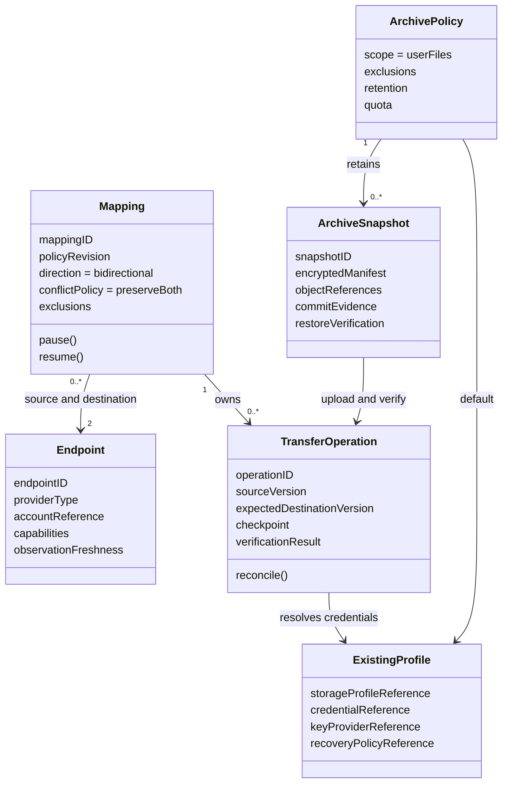
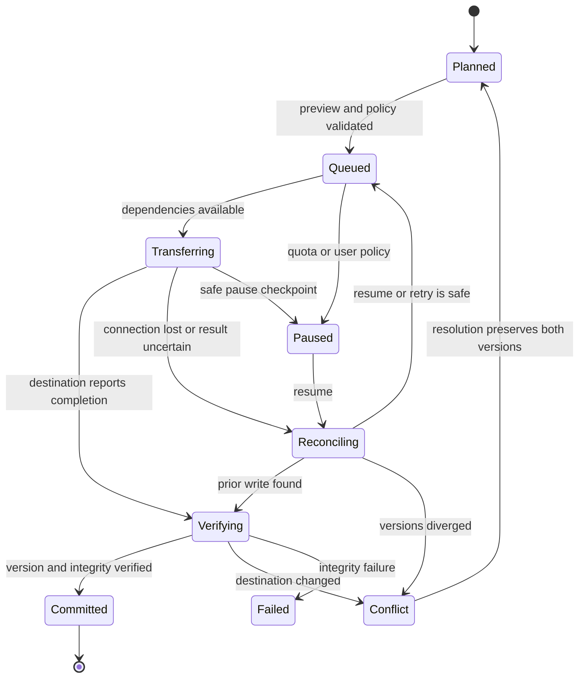
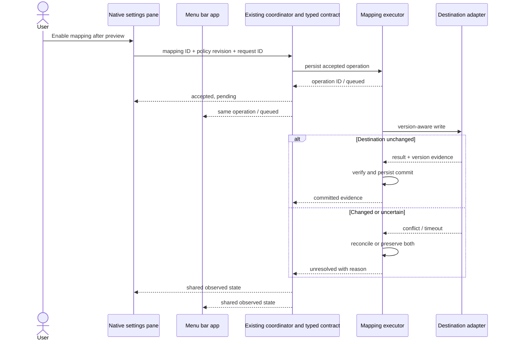

# State and data contracts

Model draft, 12 September 2026. These diagrams describe requested responsibilities and data. They do not define a new SCION topology or establish that the backend exists. The menu bar app (`MenuBarExtra`) and native settings pane (`NSPreferencePane`) are the integration surfaces described by the product review; their presence does not establish these synchronization capabilities. Services in the diagrams are logical responsibilities, not a requirement to create separate processes.

See the [technical specification](technical-spec.md) for scope and the [monitor and action registry](registry.md) for requirement IDs. All identifiers below are generic contract fields. Public examples must not contain real host, account, credential, key, or private resource values.

## Mapping and archive model

The two endpoints in a mapping are two roles. They must not resolve to the same underlying resource scope. Archive scope is broader than the selected synchronization roots. `ExistingProfile` holds references, not secret values. These fields and relationships are requirements to validate against the actual provider adapters.

## Operation states

`Committed` records a completed operation. A later change can make the mapping diverge again without changing that historical result. A separate health state reports unavailable or stale observations; it must not rewrite operation history. An `ArchiveSnapshot` becomes committed only after all required objects and its manifest have been confirmed.

## Shared state across the two interfaces

An interface may close after an operation is accepted. Execution and the durable queue remain the executor's responsibility. A command is not successfully completed merely because a button changed state. Both interfaces must report the same operation and observed result.
